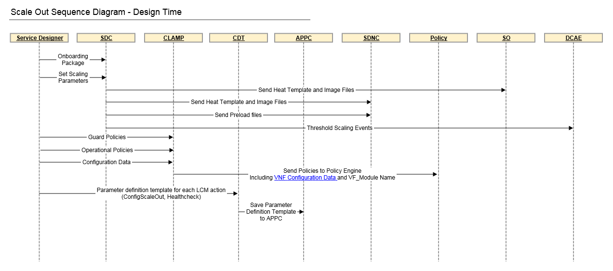
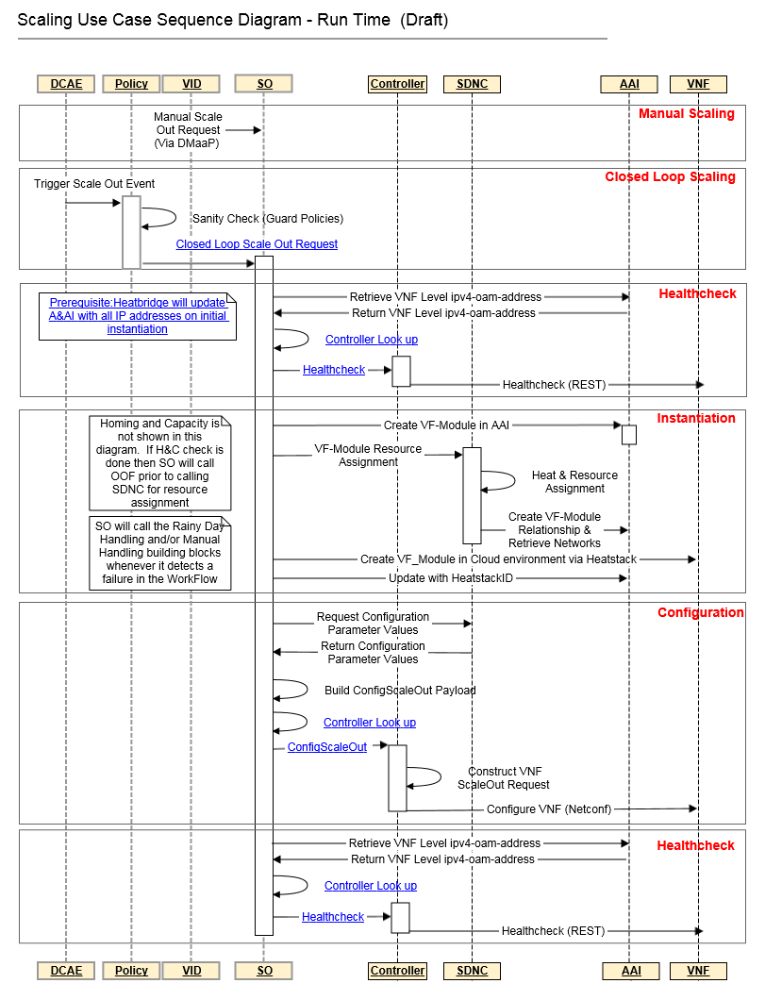

.. Modifications Copyright © 2017-2018 AT&T Intellectual Property.

.. Licensed under the Creative Commons License, Attribution 4.0 Intl.
   (the "License"); you may not use this documentation except in compliance
   with the License. You may obtain a copy of the License at

.. https://creativecommons.org/licenses/by/4.0/

.. Unless required by applicable law or agreed to in writing, software
   distributed under the License is distributed on an "AS IS" BASIS,
   WITHOUT WARRANTIES OR CONDITIONS OF ANY KIND, either express or implied.
   See the License for the specific language governing permissions and
   limitations under the License.

.. contents::
  :local:

Manual Scale Out Use Case
=========================

In the Casablanca release, ONAP will support the ability to both manually and
automatically scale out a VNF component.  Below is the sequence diagram
for how scaling will work.

|scale_out_design_time|

|scale_out_run_time|

Description of Workflow
-----------------------

At a high level the way Scale Out will work is:

1. ``VF_Modules`` (VNFC’s) may be scaled out with either one of two methods:

   a. Using VID, the operator will choose to scale out a VNFC by picking
      a ``VF_Module`` to scale
   b. An operator may define an operating policy (and associated guard
      policies) to trigger a scaling operation automatically.

      * As an example, the operating policy may be when the output of an
        application load balancer crosses a bandwidth threshold, then increase
        the number of instances of the application.
      * Examples of a guard policies:

         1. If a scaling operation has run within the past X minutes, then do
            not scale.
         2. If the number of instance is <= ``MIN_INSTANCES``
            or >= ``MAX_INSTANCES``, then do not scale.

2. VID or Policy sends the Scale Out Request to SO.
3. When SO receives the Scaling request it will first send a request to the
   appropriate controller (APPC or SDNC) to execute a health check on the VNF.
4. Once the health check has been run, SO executes the Heat Template associated
   with the VF Module requested by the VID Operator or the operational policy.
5. After the new component(s) have been instantiated SO calls the responsible
   controller (via DMaaP) to configure the new instances using Ansible, Chef,
   or Netconf.
6. Finally a health check is run to ensure that the entire VNF is Operating
   as it should.

VNF Impacts
-----------

For VNFs to make use of the Manual Scaling Capabilities of ONAP, they must
support the following functionality:

   1. VNFs must support a Healthcheck as described in:
      :ref:`onap_management_requirements`.

      a. R-41430  is the requirement dictating the need for VNF Healthchecks.
      b. The health check may be supported using REST, Ansible, or Chef

         * REST health check requirements can be found in the :ref:`xnf_rest_apis`
         * The Ansible health check playbook can be found in the :ref:`ansible_playbook_requirements`

   2. R-43413 states that a "VNF MUST utilize a modular Heat Orchestration
      Template design to support scaling". The description of this design may
      be found in the :ref:`heat_onap_vnf_modularity_overview`
      of the Heat Requirements.

      a. The ``VF_Module`` to be scaled must be built according to the VNF
         Modularity Rules for Incremental Modules

   3. Configuration of the VNF must be done via NETCONF, Chef, or Ansible as
      described in the :ref:`vnf_configuration_management`

