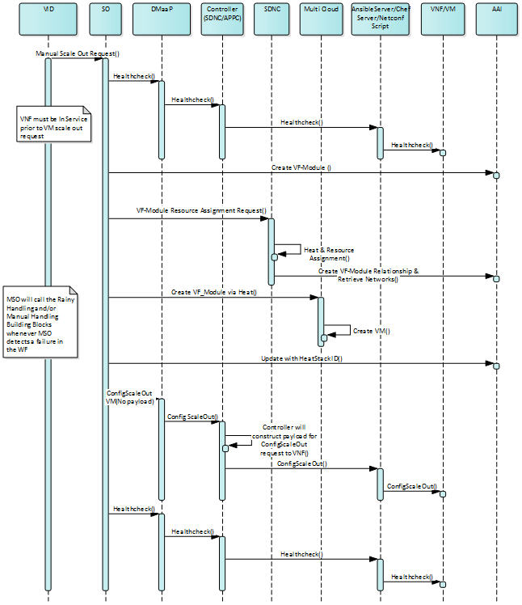

.. Modifications Copyright © 2017-2018 AT&T Intellectual Property.

.. Licensed under the Creative Commons License, Attribution 4.0 Intl.
   (the "License"); you may not use this documentation except in compliance
   with the License. You may obtain a copy of the License at

.. https://creativecommons.org/licenses/by/4.0/

.. Unless required by applicable law or agreed to in writing, software
   distributed under the License is distributed on an "AS IS" BASIS,
   WITHOUT WARRANTIES OR CONDITIONS OF ANY KIND, either express or implied.
   See the License for the specific language governing permissions and
   limitations under the License.

.. contents::
  :local:

Manual Scale Out Use Case
==================================

Since its Beijing Release, ONAP will support the ability to manually scale
out VNF Components. Below is the Sequence Diagram for how Manual Scale Out
will work in ONAP.

|image0|

Description of Workflow
---------------------------------------------

At a high level the way Manual Scale Out will work is:

 1. Using VID, the operator will choose to scale out a VNFC by picking a
    VF_Module to scale and choosing which controller is responsible for
    that VNF.
 2. VID sends the Scale Out Request to SO.
 3. When SO receives the Scaling request it will first send a request to
    the appropriate controller (APPC or SDNC) to execute a Healthcheck on the
    VNF.
 4. Once the Healthcheck has been run, SO executes the Heat Template
    associated with the VF Module requested by the VID Operator.
 5. After the new component(s) have been instantiated SO calls the
    responsible controller (via DMaaP) to configure the new instances.
 6. Finally a Healthcheck is run to ensure that the entire VNF is Operating
    as it should.

VNF Impacts
------------------------

For VNFs to make use of the Manual Scaling Capabilities of ONAP, they must
support the following functionality:

  1. VNFs must support a Healthcheck as described in: `The Management Section of the ONAP VNF Guidelines <http://onap.readthedocs.io/en/latest/submodules/vnfrqts/requirements.git/docs/Chapter7.html#vnf-rest-apis>`_.

    a. R-31809 is the requirement dictating the need for VNF Healthchecks.
    b. The Ansible Healthcheck Playbook description may be found in `The Ansible Standards and Capabilities Section <http://onap.readthedocs.io/en/latest/submodules/vnfrqts/requirements.git/docs/Chapter7.html#ansible-standards-and-capabilities>`_.

  2. VNF Heat Templates must be built according the `VNF Modularity Rules <http://onap.readthedocs.io/en/latest/submodules/vnfrqts/requirements.git/docs/Chapter4.html#d-vnf-modularity>`_.

    a. The VF_Module to be scaled must be built according the VNF
       Modularity Rules for Incremental Modules.

  3. Configuration of the VNF must be done via NETCONF, Chef, or Ansible
     as described in `Configuration Management <http://onap.readthedocs.io/en/latest/submodules/vnfrqts/requirements.git/docs/Chapter7.html#c-configuration-management>`_.

